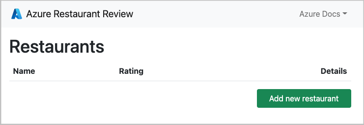

# Deploy a Python (Flask) web app with PostgreSQL in Azure

This is a Python web app using the Flask framework and the Azure Database for PostgreSQL relational database service. The Flask app is hosted in a fully managed Azure App Service. This app is designed to be be run locally and then deployed to Azure. You can either deploy this project by following the tutorial [*Deploy a Python (Django or Flask) web app with PostgreSQL in Azure*](https://docs.microsoft.com/azure/app-service/tutorial-python-postgresql-app) or by using the [Azure Developer CLI (azd)](https://learn.microsoft.com/azure/developer/azure-developer-cli/overview) according to the instructions below.

## Requirements

The [requirements.txt](./requirements.txt) has the following packages:

| Package | Description |
| ------- | ----------- |
| [Flask](https://pypi.org/project/Flask/) | Web application framework. |
| [SQLAlchemy](https://pypi.org/project/SQLAlchemy/) | Provides a database abstraction layer to communicate with PostgreSQL. |
| [Flask-SQLAlchemy](https://pypi.org/project/Flask-SQLAlchemy/) | Adds SQLAlchemy support to Flask application by simplifying using SQLAlchemy. Requires SQLAlchemy. |
| [Flask-Migrate](https://pypi.org/project/Flask-Migrate/) | SQLAlchemy database migrations for Flask applications using Alembic. Allows functionality parity with Django version of this sample app.|
| [pyscopg2](https://pypi.org/project/psycopg2/) | PostgreSQL database adapter for Python. |
| [python-dotenv](https://pypi.org/project/python-dotenv/) | Read key-value pairs from .env file and set them as environment variables. In this sample app, those variables describe how to connect to the database locally. <br><br> Flask's [dotenv support](https://flask.palletsprojects.com/en/2.1.x/cli/#environment-variables-from-dotenv) sets environment variables automatically from an `.env` file. |
| [flask_wtf](https://pypi.org/project/Flask-WTF/) | Form rendering, validation, and CSRF protection for Flask with WTForms. Uses CSRFProtect extension. |

## Using this project with the Azure Developer CLI (azd)

This project is designed to work well with the [Azure Developer CLI](https://learn.microsoft.com/azure/developer/azure-developer-cli/overview),
which makes it easier to develop apps locally, deploy them to Azure, and monitor them.

### Local development

This project has devcontainer support, so you can open it in Github Codespaces or local VS Code with the Dev Containers extension.

🎥 [Watch a screencast of running the app in Github Codespaces.](https://www.youtube.com/watch?v=r6Hnp9RXUpY)

Steps for running the server:

1. (Optional) If you're unable to open the devcontainer, [create a Python virtual environment](https://docs.python.org/3/tutorial/venv.html#creating-virtual-environments) and activate that.

2. Install the requirements:

    ```shell
    python3 -m pip install -r requirements.txt
    ```

3. Create an `.env` file using `.env.sample` as a guide. Set the value of `DBNAME` to the name of an existing database in your local PostgreSQL instance. Set the values of `DBHOST`, `DBUSER`, and `DBPASS` as appropriate for your local PostgreSQL instance. If you're in the devcontainer, copy the values from `.env.sample.devcontainer`.

4. Run the migrations:

    ```shell
    python3 -m flask db upgrade
    ```

5. Run the local server: (or use VS Code "Run" button and select "Run server")

    ```shell
    python3 -m flask run
    ```

### Deployment

This repo is set up for deployment on Azure App Service (w/PostGreSQL server) using the configuration files in the `infra` folder.

🎥 [Watch a screencast of deploying and re-deploying the app.](https://www.youtube.com/watch?v=r6Hnp9RXUpY)

Steps for deployment:

1. Sign up for a [free Azure account](https://azure.microsoft.com/free/)
2. Install the [Azure Dev CLI](https://learn.microsoft.com/azure/developer/azure-developer-cli/install-azd). (If you opened this repository in a devcontainer, that part will be done for you.)
3. Provision and deploy all the resources:

    ```shell
    azd up
    ```

    It will prompt you to login and to provide a name (like "flask-app") and location (like "eastus"). Then it will provision the resources in your account and deploy the latest code. If you get an error with deployment, changing the location (like to "centralus") can help, as there are availability constraints for some of the resources.

4. When `azd` has finished deploying, you'll see an endpoint URI in the command output. Visit that URI, and you should see the front page of the restaurant review app! 🎉 If you see an error, open the Azure Portal from the URL in the command output, navigate to the App Service, select Logstream, and check the logs for any errors.

    

5. When you've made any changes to the app code, you can just run:

    ```shell
    azd deploy
    ```

### CI/CD pipeline

This project includes a Github workflow for deploying the resources to Azure
on every push. That workflow requires several Azure-related authentication secrets to be stored as Github action secrets. To set that up, run:

```shell
azd pipeline config
```

### Monitoring

The deployed resources include a Log Analytics workspace with an Application Insights dashboard to measure metrics like server response time.

To open that dashboard, just run:

```shell
azd monitor --overview
```

## Getting help

If you're working with this project and running into issues, please post in [Issues](/issues).
